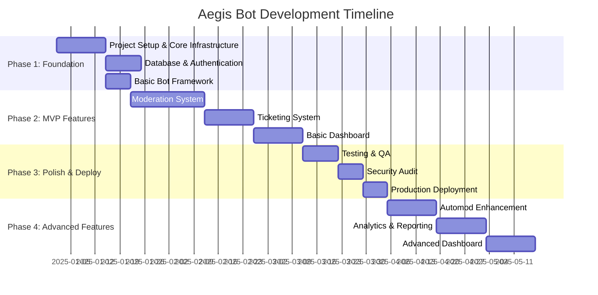

# Aegis Discord Bot - Implementation Roadmap

## Project Phases Overview



## Phase 1: Foundation (Weeks 1-4)

### Milestone 1.1: Project Setup & Infrastructure
**Duration**: 2 weeks  
**Team**: 2 developers

#### Acceptance Criteria
- ✅ Repository structure and branching strategy established
- ✅ Development environment setup documented
- ✅ CI/CD pipeline configured
- ✅ Docker containers for local development
- ✅ Monitoring and logging infrastructure

#### Deliverables
```
aegis-bot/
├── .github/workflows/
│   ├── ci.yml
│   ├── security-scan.yml
│   └── deploy.yml
├── src/
│   ├── bot/
│   ├── api/
│   ├── shared/
│   └── database/
├── docs/
│   ├── api/
│   ├── deployment/
│   └── development/
├── docker-compose.yml
├── Dockerfile
├── package.json
└── README.md
```

#### Success Metrics
- Development environment setup time < 30 minutes
- CI pipeline execution time < 5 minutes
- All security scans passing
- Documentation completeness score > 90%

### Milestone 1.2: Database & Authentication
**Duration**: 1.5 weeks  
**Team**: 1 backend developer

#### Acceptance Criteria
- ✅ PostgreSQL database schema implemented
- ✅ Redis caching layer configured
- ✅ Database migrations and seeding
- ✅ OAuth2 authentication flow
- ✅ JWT token management

#### Key Tasks
1. **Database Setup**
   - PostgreSQL container configuration
   - Migration system setup (Knex.js)
   - Connection pooling and monitoring
   - Backup and recovery procedures

2. **Authentication System**
   - Discord OAuth2 integration
   - JWT token generation and validation
   - Session management with Redis
   - Permission middleware

#### Success Metrics
- Database connection latency < 10ms
- Authentication flow completion rate > 99%
- Session management working correctly
- All database tests passing

### Milestone 1.3: Basic Bot Framework
**Duration**: 1 week  
**Team**: 1 bot developer

#### Acceptance Criteria
- ✅ Discord.js v14 integration
- ✅ Command handler system
- ✅ Event listener framework
- ✅ Basic error handling
- ✅ Logging system

#### Core Components
```typescript
// Command handler structure
interface Command {
  data: SlashCommandBuilder;
  execute: (interaction: CommandInteraction) => Promise<void>;
  permissions?: string[];
  cooldown?: number;
}

// Event handler structure
interface Event {
  name: string;
  once?: boolean;
  execute: (...args: any[]) => Promise<void>;
}
```

#### Success Metrics
- Bot startup time < 30 seconds
- Command registration success rate > 99%
- Event handling latency < 100ms
- Error recovery without downtime

---

## Phase 2: MVP Features (Weeks 5-12)

### Milestone 2.1: Moderation System
**Duration**: 3 weeks  
**Team**: 2 developers

#### Acceptance Criteria
- ✅ Complete moderation command set (warn, mute, ban, kick)
- ✅ Case management system
- ✅ Temporary action handling
- ✅ Audit logging
- ✅ Permission validation

#### Core Features
1. **Moderation Commands**
   - `/moderation warn` - Issue warnings
   - `/moderation mute` - Temporary mutes
   - `/moderation ban` - Permanent and temporary bans
   - `/moderation case` - Case management

2. **Automated Systems**
   - Automatic unmute/unban processing
   - Case expiration handling
   - Audit trail generation
   - Permission enforcement

#### Implementation Details
```typescript
// Example: Warn command implementation
class WarnCommand implements Command {
  data = new SlashCommandBuilder()
    .setName('warn')
    .setDescription('Issue a warning to a user')
    .addUserOption(option => 
      option.setName('user')
        .setDescription('User to warn')
        .setRequired(true))
    .addStringOption(option =>
      option.setName('reason')
        .setDescription('Reason for warning')
        .setRequired(true));

  async execute(interaction: CommandInteraction) {
    // Permission check
    if (!await this.hasPermission(interaction.member, 'MODERATE_MEMBERS')) {
      return interaction.reply({ 
        content: 'You do not have permission to use this command.',
        ephemeral: true 
      });
    }

    // Execute warning logic
    const case = await this.moderationService.createWarning({
      guildId: interaction.guildId,
      targetUser: interaction.options.getUser('user'),
      moderator: interaction.user,
      reason: interaction.options.getString('reason')
    });

    // Send response
    await interaction.reply({
      embeds: [this.buildWarningEmbed(case)],
      ephemeral: true
    });
  }
}
```

#### Success Metrics
- Moderation command response time < 500ms
- Case creation success rate > 99.9%
- Automatic expiration accuracy > 99.5%
- Audit log completeness 100%

### Milestone 2.2: Ticketing System
**Duration**: 2 weeks  
**Team**: 1 developer

#### Acceptance Criteria
- ✅ Ticket creation via slash commands
- ✅ Private channel management
- ✅ Staff assignment system
- ✅ Transcript generation
- ✅ Category-based routing

#### Core Features
1. **Ticket Management**
   - `/ticket create` - Create new tickets
   - Button interactions for claim/close
   - Automatic transcript generation
   - Department routing

2. **Staff Tools**
   - Ticket assignment system
   - Priority management
   - Bulk operations
   - Performance metrics

#### Technical Implementation
```typescript
// Ticket creation flow
class TicketService {
  async createTicket(options: CreateTicketOptions): Promise<Ticket> {
    // Create private channel
    const channel = await guild.channels.create({
      name: `ticket-${ticketId}`,
      type: ChannelType.GuildText,
      parent: settings.ticketCategory,
      permissionOverwrites: [
        {
          id: guild.roles.everyone,
          deny: [PermissionFlagsBits.ViewChannel]
        },
        {
          id: options.creator,
          allow: [PermissionFlagsBits.ViewChannel, PermissionFlagsBits.SendMessages]
        }
      ]
    });

    // Store in database
    const ticket = await this.repository.create({
      guildId: guild.id,
      channelId: channel.id,
      creatorUser: options.creator,
      category: options.category,
      subject: options.subject
    });

    // Send welcome message
    await this.sendWelcomeMessage(channel, ticket);

    return ticket;
  }
}
```

#### Success Metrics
- Ticket creation time < 5 seconds
- Transcript generation success rate > 99%
- Staff response time < 15 minutes (tracked)
- User satisfaction > 4.5/5 (survey)

### Milestone 2.3: Basic Dashboard
**Duration**: 2 weeks  
**Team**: 1 frontend developer

#### Acceptance Criteria
- ✅ OAuth2 login with Discord
- ✅ Guild selection and management
- ✅ Basic settings configuration
- ✅ Moderation case viewer
- ✅ Responsive design

#### Core Pages
1. **Dashboard Home**
   - Guild overview statistics
   - Recent activity feed
   - Quick action buttons
   - System status

2. **Moderation Panel**
   - Case search and filtering
   - Bulk actions
   - Moderator performance
   - Appeal management

3. **Settings**
   - Bot configuration
   - Feature toggles
   - Permission management
   - Integration setup

#### Tech Stack
- **Frontend**: Next.js 14 with TypeScript
- **Styling**: Tailwind CSS
- **State Management**: Zustand
- **API Client**: TanStack Query
- **Authentication**: NextAuth.js

#### Success Metrics
- Page load time < 2 seconds
- Mobile responsiveness score > 95%
- User adoption rate > 60% of guild admins
- Task completion rate > 85%

---

## Phase 3: Polish & Deploy (Weeks 13-16)

### Milestone 3.1: Testing & Quality Assurance
**Duration**: 1.5 weeks  
**Team**: 2 developers + 1 QA

#### Acceptance Criteria
- ✅ Unit test coverage > 80%
- ✅ Integration test suite complete
- ✅ Load testing results meet targets
- ✅ Security testing passed
- ✅ Documentation complete

#### Testing Strategy
1. **Unit Tests**
   - Command logic testing
   - Service layer testing
   - Utility function testing
   - Database repository testing

2. **Integration Tests**
   - API endpoint testing
   - Database integration testing
   - Discord API integration testing
   - Authentication flow testing

3. **Load Testing**
   - Concurrent user testing
   - Database performance testing
   - Memory leak detection
   - Stress testing scenarios

#### Test Automation
```typescript
// Example test suite structure
describe('ModerationService', () => {
  describe('createWarning', () => {
    it('should create a warning case successfully', async () => {
      const warning = await moderationService.createWarning({
        guildId: '123',
        targetUser: '456',
        moderator: '789',
        reason: 'Test warning'
      });

      expect(warning.caseId).toBeDefined();
      expect(warning.actionType).toBe('warn');
      expect(warning.status).toBe('active');
    });

    it('should fail with invalid permissions', async () => {
      await expect(moderationService.createWarning({
        guildId: '123',
        targetUser: '456',
        moderator: '999', // No permissions
        reason: 'Test warning'
      })).rejects.toThrow('Insufficient permissions');
    });
  });
});
```

#### Success Metrics
- Test coverage > 80%
- Test execution time < 10 minutes
- Zero critical bugs in production
- Performance benchmarks met

### Milestone 3.2: Security Audit
**Duration**: 1 week  
**Team**: Security specialist + 1 developer

#### Acceptance Criteria
- ✅ Penetration testing completed
- ✅ Code security review passed
- ✅ Dependency vulnerability scan clean
- ✅ Data protection compliance verified
- ✅ Security documentation updated

#### Security Checklist
- [ ] **Authentication & Authorization**
  - OAuth2 flow security
  - JWT token validation
  - Permission enforcement
  - Session management

- [ ] **Data Protection**
  - Input validation
  - SQL injection prevention
  - XSS protection
  - CSRF protection

- [ ] **Infrastructure Security**
  - Container security
  - Network security
  - Secret management
  - Access control

#### Success Metrics
- Zero high-severity vulnerabilities
- All security tests passing
- Compliance checklist 100% complete
- Security documentation updated

### Milestone 3.3: Production Deployment
**Duration**: 1 week  
**Team**: DevOps engineer + 1 developer

#### Acceptance Criteria
- ✅ Production environment configured
- ✅ Monitoring and alerting active
- ✅ Backup systems operational
- ✅ Scaling procedures documented
- ✅ Rollback procedures tested

#### Deployment Checklist
1. **Infrastructure Setup**
   - Kubernetes cluster configuration
   - Database setup and replication
   - Redis cluster configuration
   - Load balancer configuration

2. **Monitoring Setup**
   - Prometheus metrics collection
   - Grafana dashboards
   - Log aggregation (Loki/ELK)
   - Error tracking (Sentry)

3. **Security Configuration**
   - TLS certificates
   - Firewall rules
   - Access controls
   - Secret management

#### Success Metrics
- Deployment time < 30 minutes
- Zero-downtime deployment achieved
- All monitoring systems operational
- Recovery procedures tested

---

## Phase 4: Advanced Features (Weeks 17-24)

### Milestone 4.1: Enhanced Automod
**Duration**: 2 weeks  
**Team**: 2 developers

#### Features
- Advanced spam detection algorithms
- Custom rule engine
- Machine learning integration (optional)
- False positive reduction
- Performance optimization

### Milestone 4.2: Analytics & Reporting
**Duration**: 2 weeks  
**Team**: 1 developer

#### Features
- Advanced metrics collection
- Custom report generation
- Data visualization
- Export capabilities
- Performance insights

### Milestone 4.3: Advanced Dashboard
**Duration**: 2 weeks  
**Team**: 1 frontend developer

#### Features
- Real-time updates
- Advanced filtering
- Bulk operations
- Mobile app considerations
- Integration management

---

## Risk Management & Mitigation

### High-Risk Items
1. **Discord API Rate Limits**
   - **Risk**: Bot suspension due to rate limit violations
   - **Mitigation**: Implement robust rate limiting and queue system
   - **Contingency**: Manual fallback procedures

2. **Database Performance**
   - **Risk**: Slow queries affecting user experience
   - **Mitigation**: Proper indexing and query optimization
   - **Contingency**: Read replicas and caching

3. **Security Vulnerabilities**
   - **Risk**: Data breach or unauthorized access
   - **Mitigation**: Regular security audits and testing
   - **Contingency**: Incident response plan

### Medium-Risk Items
1. **Third-party Dependencies**
   - **Risk**: Breaking changes in discord.js or other libraries
   - **Mitigation**: Pin versions and test updates thoroughly
   - **Contingency**: Fork critical dependencies if needed

2. **Scaling Challenges**
   - **Risk**: Performance degradation with growth
   - **Mitigation**: Load testing and performance monitoring
   - **Contingency**: Horizontal scaling procedures

---

## Success Metrics & KPIs

### Technical Metrics
- **Uptime**: > 99.9%
- **Response Time**: < 300ms for cached operations
- **Error Rate**: < 0.1%
- **Test Coverage**: > 80%

### Business Metrics
- **User Adoption**: > 1,000 guilds in first 6 months
- **User Satisfaction**: > 4.5/5 rating
- **Support Tickets**: < 5% of monthly active users
- **Retention Rate**: > 80% monthly retention

### Performance Metrics
- **Commands Per Second**: > 100 CPS sustained
- **Concurrent Users**: > 10,000 simultaneous users
- **Database Performance**: < 100ms average query time
- **Memory Usage**: < 2GB per bot instance

---

## Post-Launch Roadmap

### Months 1-3: Stabilization
- Bug fixes and performance optimization
- User feedback implementation
- Documentation improvements
- Community building

### Months 4-6: Growth Features
- Advanced integrations
- Plugin system development
- Mobile app consideration
- Enterprise features

### Months 7-12: Scale & Innovation
- AI/ML integration
- Advanced analytics
- Multi-language support
- Marketplace features

This roadmap provides a clear path from concept to production, with specific milestones, acceptance criteria, and success metrics to ensure the Aegis Discord bot becomes a professional, reliable, and feature-rich platform.