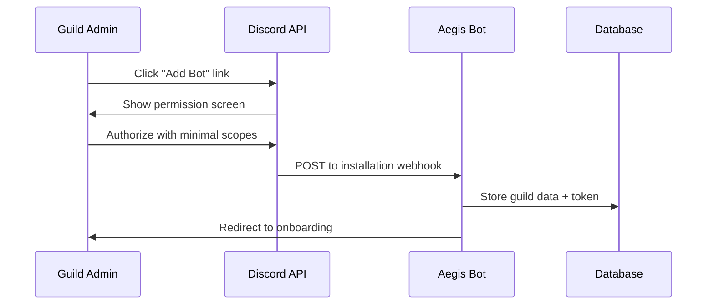

# Aegis Discord Bot - Security & Compliance Plan

## OAuth2 & Authentication

### Bot Installation Flow


### Required OAuth2 Scopes
```json
{
  "bot_permissions": {
    "required": [
      "VIEW_CHANNELS",
      "SEND_MESSAGES", 
      "EMBED_LINKS",
      "READ_MESSAGE_HISTORY",
      "USE_SLASH_COMMANDS",
      "MANAGE_MESSAGES",
      "MODERATE_MEMBERS",
      "BAN_MEMBERS",
      "MANAGE_ROLES"
    ],
    "optional": [
      "MANAGE_CHANNELS",
      "MANAGE_WEBHOOKS",
      "VIEW_AUDIT_LOG"
    ],
    "never_request": [
      "ADMINISTRATOR"
    ]
  },
  "oauth_scopes": [
    "bot",
    "applications.commands"
  ]
}
```

### Installation Security Checklist
- ✅ Use least privilege principle for permissions
- ✅ Validate guild ownership during installation
- ✅ Store installation tokens encrypted at rest
- ✅ Implement token rotation mechanism
- ✅ Verify webhook signatures for installation events
- ✅ Rate limit installation attempts per IP/user

## Token Management & Encryption

### Secret Storage Strategy
```javascript
// Environment variables for secrets
const secrets = {
  DISCORD_TOKEN: process.env.DISCORD_TOKEN,
  DATABASE_URL: process.env.DATABASE_URL,
  REDIS_URL: process.env.REDIS_URL,
  JWT_SECRET: process.env.JWT_SECRET,
  ENCRYPTION_KEY: process.env.ENCRYPTION_KEY
};

// Field-level encryption for sensitive data
const crypto = require('crypto');

class EncryptionService {
  constructor(key) {
    this.algorithm = 'aes-256-gcm';
    this.key = Buffer.from(key, 'hex');
  }

  encrypt(text) {
    const iv = crypto.randomBytes(16);
    const cipher = crypto.createCipher(this.algorithm, this.key, iv);
    
    let encrypted = cipher.update(text, 'utf8', 'hex');
    encrypted += cipher.final('hex');
    
    const authTag = cipher.getAuthTag();
    
    return {
      encrypted,
      iv: iv.toString('hex'),
      authTag: authTag.toString('hex')
    };
  }

  decrypt(encryptedData) {
    const decipher = crypto.createDecipher(
      this.algorithm, 
      this.key, 
      Buffer.from(encryptedData.iv, 'hex')
    );
    
    decipher.setAuthTag(Buffer.from(encryptedData.authTag, 'hex'));
    
    let decrypted = decipher.update(encryptedData.encrypted, 'hex', 'utf8');
    decrypted += decipher.final('utf8');
    
    return decrypted;
  }
}
```

### Database Encryption
```sql
-- PostgreSQL encryption at rest
CREATE EXTENSION IF NOT EXISTS pgcrypto;

-- Encrypted fields for PII
CREATE TABLE users (
  user_id BIGINT PRIMARY KEY,
  username VARCHAR(32) NOT NULL,
  email_encrypted BYTEA, -- Encrypted with pgp_sym_encrypt
  created_at TIMESTAMP DEFAULT NOW(),
  updated_at TIMESTAMP DEFAULT NOW()
);

-- Example encrypted insert
INSERT INTO users (user_id, username, email_encrypted) 
VALUES (
  $1, 
  $2, 
  pgp_sym_encrypt($3, current_setting('app.encryption_key'))
);
```

## Rate Limiting & Anti-Abuse

### Multi-Layer Rate Limiting
```javascript
// Redis-based rate limiting
class RateLimiter {
  constructor(redis) {
    this.redis = redis;
  }

  async checkLimit(key, limit, window) {
    const multi = this.redis.multi();
    const now = Date.now();
    const windowStart = now - window * 1000;

    // Sliding window log
    multi.zremrangebyscore(key, 0, windowStart);
    multi.zadd(key, now, now);
    multi.zcard(key);
    multi.expire(key, window);

    const results = await multi.exec();
    const count = results[2][1];

    return {
      allowed: count <= limit,
      count,
      limit,
      resetTime: now + window * 1000
    };
  }
}

// Rate limit configurations
const RATE_LIMITS = {
  // Per-user command limits
  USER_COMMANDS: { limit: 30, window: 60 }, // 30 commands per minute
  USER_MODERATION: { limit: 10, window: 60 }, // 10 mod actions per minute
  
  // Per-guild limits
  GUILD_TICKETS: { limit: 50, window: 3600 }, // 50 tickets per hour
  GUILD_CASES: { limit: 100, window: 3600 }, // 100 cases per hour
  
  // Global limits
  API_REQUESTS: { limit: 1000, window: 60 }, // 1000 API calls per minute
  WEBHOOK_CALLS: { limit: 100, window: 60 } // 100 webhooks per minute
};
```

### Anti-Abuse Heuristics
```javascript
// Spam detection system
class SpamDetector {
  async detectSpam(message, user, guild) {
    const checks = [
      this.checkMessageRate(user.id, guild.id),
      this.checkDuplicateContent(message.content, guild.id),
      this.checkMentionSpam(message, guild.id),
      this.checkLinkSpam(message.content, user.id),
      this.checkNewUserBehavior(user, guild)
    ];

    const results = await Promise.all(checks);
    const score = results.reduce((sum, result) => sum + result.score, 0);
    
    return {
      isSpam: score >= 0.7,
      score,
      triggers: results.filter(r => r.triggered),
      action: this.getRecommendedAction(score)
    };
  }

  async checkMessageRate(userId, guildId) {
    const key = `msg_rate:${guildId}:${userId}`;
    const count = await this.redis.get(key) || 0;
    
    if (count > 5) { // 5 messages in last 10 seconds
      return { score: 0.8, triggered: true, reason: 'message_flood' };
    }
    
    await this.redis.setex(key, 10, parseInt(count) + 1);
    return { score: Math.min(count * 0.1, 0.5), triggered: false };
  }

  getRecommendedAction(score) {
    if (score >= 0.9) return 'BAN';
    if (score >= 0.7) return 'MUTE';
    if (score >= 0.5) return 'WARN';
    return 'DELETE';
  }
}
```

### Anti-Raid Protection
```javascript
// Raid detection and mitigation
class RaidProtection {
  async checkJoinPattern(guild) {
    const joinKey = `joins:${guild.id}`;
    const joins = await this.redis.zcard(joinKey);
    
    // If more than 10 joins in 30 seconds, activate raid protection
    if (joins > 10) {
      await this.activateRaidMode(guild);
      return true;
    }
    
    return false;
  }

  async activateRaidMode(guild) {
    const actions = [
      this.pauseInvites(guild),
      this.enableVerificationLevel(guild, 'HIGH'),
      this.notifyModerators(guild, 'RAID_DETECTED'),
      this.enableJoinCaptcha(guild)
    ];

    await Promise.all(actions);
    
    // Auto-disable after 1 hour
    setTimeout(() => this.deactivateRaidMode(guild), 3600000);
  }
}
```

## GDPR Compliance & Data Retention

### Data Classification
```javascript
// Data retention policies
const DATA_RETENTION = {
  PERSONAL_DATA: {
    // PII - Subject to GDPR deletion
    user_profiles: { retention: 'indefinite', deletable: true },
    dm_logs: { retention: '90_days', deletable: true },
    voice_recordings: { retention: 'none', deletable: true }
  },
  
  OPERATIONAL_DATA: {
    // Business necessity - Limited retention
    moderation_cases: { retention: '2_years', deletable: false },
    audit_logs: { retention: '2_years', deletable: false },
    command_usage: { retention: '90_days', deletable: true }
  },
  
  ANALYTICS_DATA: {
    // Anonymized - Longer retention OK
    usage_metrics: { retention: '5_years', deletable: true },
    performance_logs: { retention: '30_days', deletable: true }
  }
};

// GDPR deletion service
class GDPRService {
  async deleteUserData(userId) {
    const deletionLog = {
      userId,
      timestamp: new Date(),
      requestId: crypto.randomUUID(),
      status: 'pending'
    };

    try {
      // Delete from all tables
      await this.db.transaction(async (trx) => {
        await trx('users').where('user_id', userId).del();
        await trx('user_settings').where('user_id', userId).del();
        
        // Anonymize instead of delete for audit trail
        await trx('moderation_cases')
          .where('target_user', userId)
          .update({ target_user: null, target_username: '[DELETED]' });
        
        // Remove from cache
        await this.redis.del(`user:${userId}:*`);
      });

      deletionLog.status = 'completed';
      await this.logDeletion(deletionLog);
      
    } catch (error) {
      deletionLog.status = 'failed';
      deletionLog.error = error.message;
      await this.logDeletion(deletionLog);
      throw error;
    }
  }
}
```

### Data Export Service
```javascript
// GDPR data export
class DataExportService {
  async exportUserData(userId) {
    const userData = {
      user_profile: await this.getUserProfile(userId),
      guild_memberships: await this.getGuildMemberships(userId),
      moderation_history: await this.getModerationHistory(userId),
      settings: await this.getUserSettings(userId),
      command_usage: await this.getCommandUsage(userId),
      export_metadata: {
        generated_at: new Date().toISOString(),
        format_version: '1.0',
        request_id: crypto.randomUUID()
      }
    };

    return {
      data: userData,
      format: 'json',
      filename: `aegis_data_export_${userId}_${Date.now()}.json`
    };
  }
}
```

## Permission Model & RBAC

### Role-Based Access Control
```javascript
// Permission system
const PERMISSIONS = {
  // Bot permissions
  BOT_ADMIN: 'bot:admin',
  BOT_MODERATOR: 'bot:moderator',
  BOT_VIEWER: 'bot:viewer',
  
  // Guild permissions
  GUILD_ADMIN: 'guild:admin',
  GUILD_MODERATOR: 'guild:moderator',
  GUILD_MEMBER: 'guild:member',
  
  // Feature permissions
  MODERATION_VIEW: 'mod:view',
  MODERATION_WARN: 'mod:warn',
  MODERATION_MUTE: 'mod:mute',
  MODERATION_BAN: 'mod:ban',
  
  TICKETS_VIEW: 'tickets:view',
  TICKETS_MANAGE: 'tickets:manage',
  TICKETS_ADMIN: 'tickets:admin',
  
  SETTINGS_VIEW: 'settings:view',
  SETTINGS_EDIT: 'settings:edit'
};

class PermissionService {
  async checkPermission(userId, guildId, permission) {
    // Check cached permissions first
    const cacheKey = `perms:${guildId}:${userId}`;
    let permissions = await this.redis.get(cacheKey);
    
    if (!permissions) {
      permissions = await this.calculatePermissions(userId, guildId);
      await this.redis.setex(cacheKey, 300, JSON.stringify(permissions));
    } else {
      permissions = JSON.parse(permissions);
    }
    
    return permissions.includes(permission);
  }

  async calculatePermissions(userId, guildId) {
    const member = await this.getMember(guildId, userId);
    const roles = await this.getRoles(guildId, member.roles);
    
    let permissions = new Set();
    
    // Bot owner gets all permissions
    if (userId === process.env.BOT_OWNER_ID) {
      return Object.values(PERMISSIONS);
    }
    
    // Discord permissions mapping
    if (member.permissions.has('ADMINISTRATOR')) {
      permissions.add(PERMISSIONS.GUILD_ADMIN);
    }
    
    if (member.permissions.has('MANAGE_GUILD')) {
      permissions.add(PERMISSIONS.SETTINGS_EDIT);
    }
    
    // Custom role permissions
    for (const role of roles) {
      const rolePerms = await this.getRolePermissions(guildId, role.id);
      rolePerms.forEach(perm => permissions.add(perm));
    }
    
    return Array.from(permissions);
  }
}
```

## Webhook Security

### Signature Verification
```javascript
// Webhook signature verification
class WebhookSecurity {
  verifySignature(payload, signature, secret) {
    const expectedSignature = crypto
      .createHmac('sha256', secret)
      .update(payload)
      .digest('hex');
    
    const providedSignature = signature.replace('sha256=', '');
    
    return crypto.timingSafeEqual(
      Buffer.from(expectedSignature, 'hex'),
      Buffer.from(providedSignature, 'hex')
    );
  }

  async processWebhook(req, res) {
    const signature = req.headers['x-hub-signature-256'];
    const payload = JSON.stringify(req.body);
    
    if (!this.verifySignature(payload, signature, process.env.WEBHOOK_SECRET)) {
      return res.status(401).json({ error: 'Invalid signature' });
    }
    
    // Process webhook
    await this.handleWebhookEvent(req.body);
    res.status(200).json({ received: true });
  }
}
```

## Security Monitoring & Alerting

### Security Event Logging
```javascript
// Security event logger
class SecurityLogger {
  async logSecurityEvent(event) {
    const securityEvent = {
      timestamp: new Date().toISOString(),
      event_type: event.type,
      severity: event.severity,
      user_id: event.userId,
      guild_id: event.guildId,
      ip_address: event.ip,
      user_agent: event.userAgent,
      details: event.details,
      event_id: crypto.randomUUID()
    };

    // Log to security audit table
    await this.db('security_events').insert(securityEvent);
    
    // Send to SIEM if configured
    if (process.env.SIEM_WEBHOOK) {
      await this.sendToSIEM(securityEvent);
    }
    
    // Alert on critical events
    if (event.severity === 'CRITICAL') {
      await this.sendCriticalAlert(securityEvent);
    }
  }
}

// Security events to monitor
const SECURITY_EVENTS = {
  FAILED_LOGIN: { severity: 'LOW', threshold: 5 },
  RATE_LIMIT_EXCEEDED: { severity: 'MEDIUM', threshold: 3 },
  PERMISSION_ESCALATION: { severity: 'HIGH', threshold: 1 },
  BULK_ACTION_ATTEMPT: { severity: 'MEDIUM', threshold: 2 },
  SUSPICIOUS_API_USAGE: { severity: 'HIGH', threshold: 1 },
  DATA_EXPORT_REQUEST: { severity: 'LOW', threshold: null },
  ADMIN_ACTION: { severity: 'LOW', threshold: null }
};
```

## Compliance Checklist

### GDPR Compliance
- ✅ **Lawful Basis**: Legitimate interest for bot functionality
- ✅ **Data Minimization**: Collect only necessary data
- ✅ **Purpose Limitation**: Use data only for stated purposes
- ✅ **Storage Limitation**: Implement data retention policies
- ✅ **Right to Access**: Provide data export functionality
- ✅ **Right to Rectification**: Allow users to update their data
- ✅ **Right to Erasure**: Implement account deletion
- ✅ **Data Portability**: Export data in machine-readable format
- ✅ **Privacy by Design**: Build privacy into system architecture

### Discord Terms of Service
- ✅ **No Automated DM Spam**: Never send unsolicited DMs
- ✅ **Rate Limit Compliance**: Respect Discord API limits
- ✅ **Content Policy**: Filter inappropriate content
- ✅ **User Privacy**: Don't log DM content
- ✅ **API Usage**: Follow Discord API terms
- ✅ **Verified Bot**: Apply for verification if serving 100+ guilds

### Security Standards
- ✅ **OWASP Top 10**: Address all common vulnerabilities
- ✅ **Input Validation**: Sanitize all user inputs
- ✅ **Authentication**: Secure login mechanisms
- ✅ **Authorization**: Proper permission checks
- ✅ **Encryption**: Protect data in transit and at rest
- ✅ **Logging**: Comprehensive audit trails
- ✅ **Monitoring**: Real-time security monitoring
- ✅ **Incident Response**: Plan for security incidents

## Security Testing

### Automated Security Scanning
```yaml
# GitHub Actions security workflow
name: Security Scan
on: [push, pull_request]

jobs:
  security:
    runs-on: ubuntu-latest
    steps:
      - uses: actions/checkout@v3
      
      - name: Run Snyk Security Scan
        uses: snyk/actions/node@master
        env:
          SNYK_TOKEN: ${{ secrets.SNYK_TOKEN }}
      
      - name: Run ESLint Security Rules
        run: npm run lint:security
      
      - name: Audit Dependencies
        run: npm audit --audit-level=high
      
      - name: SAST Scan
        uses: github/codeql-action/analyze@v2
```

### Manual Security Testing
- **Penetration Testing**: Quarterly external assessment
- **Code Review**: Security-focused peer review process
- **Threat Modeling**: Document and assess attack vectors
- **Red Team Exercises**: Simulated attack scenarios